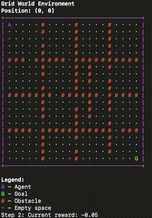
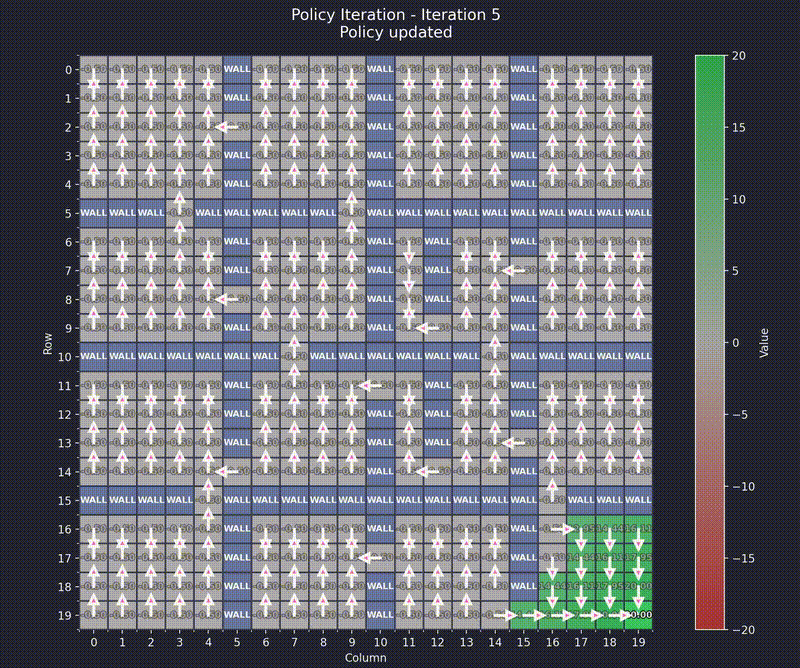
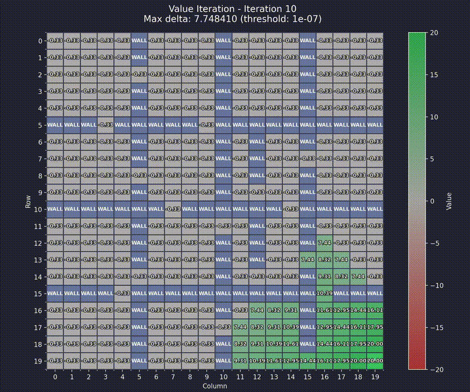

# Grid World Reinforcement Learning

This project implements a Grid World environment for Reinforcement Learning, featuring both Policy Iteration and Value Iteration algorithms for solving the Markov Decision Process (MDP).

## Environment

The Grid World is a 2D grid where an agent can:

- Move in four directions: up, down, left, right
- Navigate around obstacles
- Receive defined rewards for each step, hitting obstacles, and goal state.

The environment follows the standard RL framework:

1. The agent observes the current state
2. It selects an action according to its policy
3. The environment transitions to a new state and provides a reward
4. This process repeats until the agent reaches a terminal state (goal)

## Algorithms

### Value Iteration

Value Iteration solves an MDP by iteratively improving the value function until convergence. It uses the Bellman optimality equation:

$V_{k+1}(s) = \max_a [R(s, a) + \gamma \sum_{s'} P(s'|s,a) V_k(s')]$

Where:
- $V_k(s)$ is the value of state $s$ at iteration $k$
- $R(s, a)$ is the reward for taking action $a$ in state $s$
- $\gamma$ is the discount factor
- $P(s'|s,a)$ is the probability of transitioning to state $s'$ when taking action $a$ in state $s$

### Policy Iteration

Policy Iteration alternates between policy evaluation and policy improvement steps:

1. **Policy Evaluation**: Calculate the value function for the current policy using the Bellman expectation equation:

   $V^\pi(s) = R(s, \pi(s)) + \gamma \sum_{s'} P(s'|s,\pi(s)) V^\pi(s')$

2. **Policy Improvement**: Update the policy to be greedy with respect to the current value function:

   $\pi'(s) = \arg\max_a [R(s, a) + \gamma \sum_{s'} P(s'|s,a) V^\pi(s')]$

Both algorithms work by computing the optimal value function, which represents the expected total reward from each state. The optimal policy is then derived by selecting actions that maximize this value function.

## Usage Example

Here's how to create a complex maze and solve it using either Value Iteration or Policy Iteration:

```python
from grid_world.solution import GridWorldSolution, GridWorld

big_maze = GridWorld(
    width=20,
    height=20,
    start_position=(0, 0),
    goal_position=(19, 19),
    obstacle_positions=[
        # Spiral pattern with openings remains unchanged.
        *[(x, 5) for x in range(20) if x not in {2, 8, 14}],
        *[(x, 10) for x in range(20) if x not in {5, 11, 17}],
        *[(x, 15) for x in range(20) if x not in {7, 13, 19}],

        # Vertical barriers:
        # - Column 5: same as before.
        *[(5, y) for y in range(20) if y not in {3, 9, 15}],
        # - Column 10: now only two gaps at y=7 and y=14.
        *[(10, y) for y in range(20) if y not in {7, 14}],
        # - Column 15: kept as in the original.
        *[(15, y) for y in range(20) if y not in {4, 10, 16}],

        # Removed the diagonal barrier and the random obstacles.

        # Additional horizontal barrier to force a detour:
        # This wall at row 12 spans from x=6 to x=13, with a single gap at x=9.
        *[(x, 12) for x in range(6, 14) if x != 9],
    ],
    blocked_reward=-1.5,
    goal_reward=20.0,
    step_reward=-0.05  # Strong incentive for the shortest path.
)

solver = GridWorldSolution(big_maze)

solver.run()
# Choose algorithm:
# 1. Value Iteration
# 2. Policy Iteration
# Enter choice (1/2):
```

## Visualizations

Once the solution is computed, the project provides three types of visualizations:

### Agent Path Execution

The agent follows the optimal policy to reach the goal:



### Policy Visualization

The arrows show the optimal action to take in each state:



### Value Function Visualization

The heatmap shows the expected return from each state:

