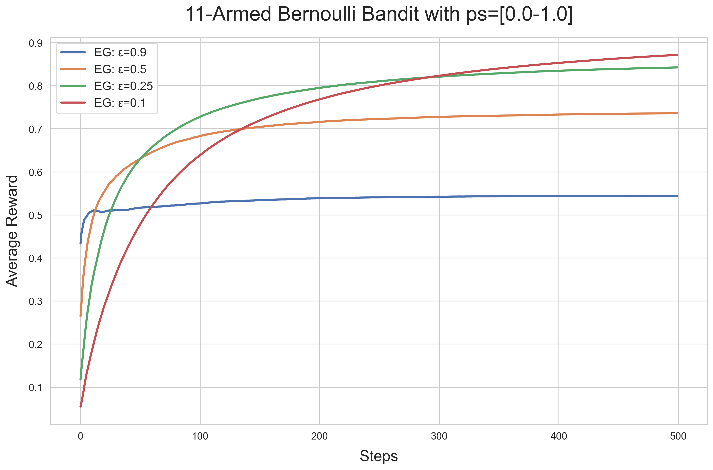
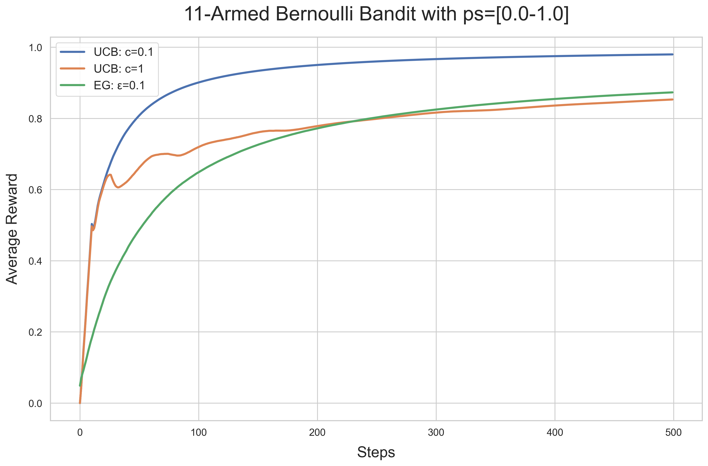
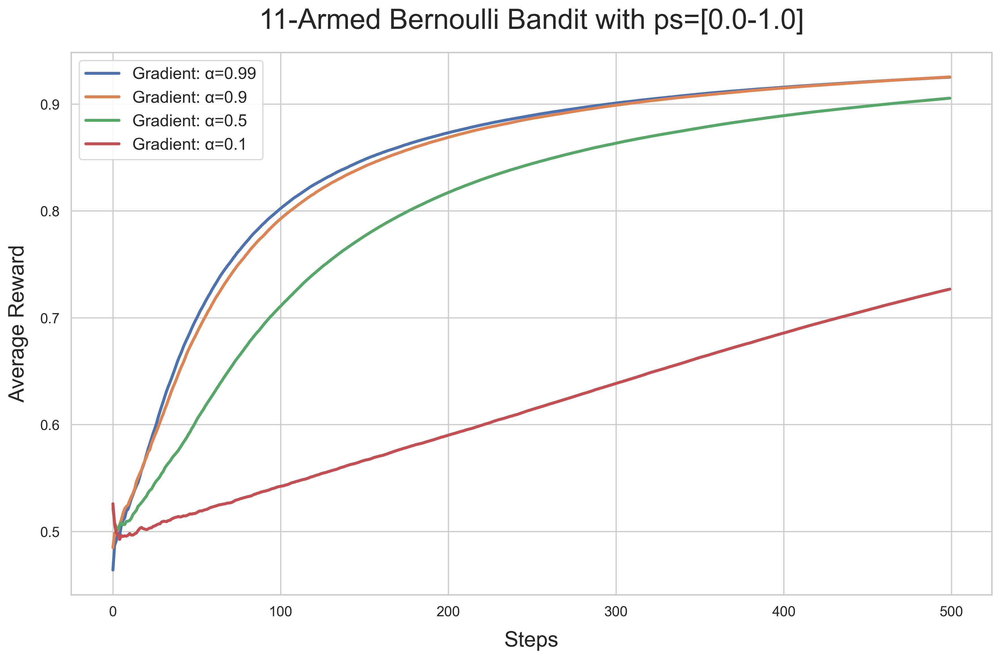
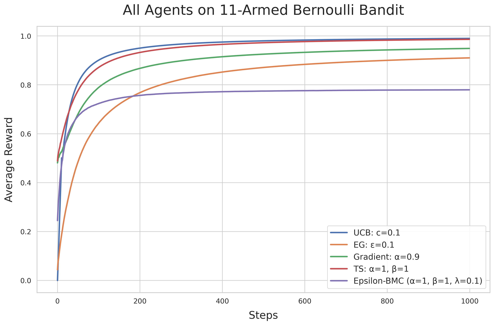
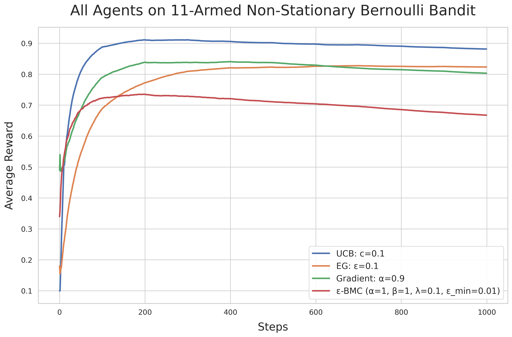

# Multi-Armed Bandit Problem

## Introduction

The multi-armed bandit problem is a classic reinforcement learning scenario where an agent must balance exploration (trying new actions to gather information) and exploitation (choosing the best known action to maximize reward). The name comes from the analogy of a gambler facing multiple slot machines (bandits) with different, unknown reward probabilities.

In this problem:

- We have n different actions (arms) to choose from
- Each action provides a reward from an unknown probability distribution
- The goal is to maximize the total reward over time

The challenge lies in the exploration-exploitation dilemma: should we exploit the arm that has given the best rewards so far, or explore other arms that might potentially be better?

## Simulation

Our simulation implements a framework for testing different bandit algorithms. The core components include:

1. **Bandits**: Represent the reward-generating mechanisms

   - `BernoulliBandit`: Returns rewards of 0 or 1 based on a specified probability for each arm
   - **NonStationaryBernoulliBandit**: Implements a Gaussian random walk for reward probabilities:
     - Reward probabilities perturbed every `walk_every` steps
     - Step size controlled by `step_std` parameter
     - Automatically resets to original probabilities when environment resets

2. **Agents**: Implement different strategies for selecting arms

   - Each agent maintains estimates of arm values and updates them based on observed rewards
   - Agents implement the exploration-exploitation trade-off in different ways

3. **Simulation**: Runs the interaction between agents and bandits

   - For each step, the agent selects an arm, the bandit provides a reward, and the agent updates its knowledge

4. **Experiment Manager**: Handles running multiple simulations and visualizing results
   - Runs multiple agents against the same bandit for comparison
   - Averages results over multiple runs to reduce variance
   - Generates plots showing the performance of different algorithms

## Implemented Methods

### Epsilon-Greedy (ε-greedy)

The epsilon-greedy method is one of the simplest approaches to the exploration-exploitation dilemma:

- With probability ε, the agent explores by selecting a random arm
- With probability 1-ε, the agent exploits by selecting the arm with the highest estimated value

The parameter ε controls the exploration rate. Higher values of ε lead to more exploration, while lower values favor exploitation.



As shown in the graph, different ε values lead to different performance characteristics:

- Higher ε values (0.9, 0.5) result in more exploration but potentially lower average rewards
- Lower ε values (0.25, 0.1) focus more on exploitation, which can lead to higher average rewards if the best arm is identified early

### Upper Confidence Bound (UCB)

The UCB algorithm addresses the exploration-exploitation dilemma more systematically by considering both the estimated value of each arm and the uncertainty in that estimate:

- For each arm, UCB calculates a confidence bound that represents the upper limit of what the true value might be
- The agent selects the arm with the highest upper confidence bound
- As an arm is pulled more frequently, its confidence bound shrinks

The formula used is: UCB = Q(a) + c \* √(ln(t) / N(a))

- Q(a): estimated value of arm a
- N(a): number of times arm a has been selected
- t: total number of actions taken so far
- c: exploration parameter controlling the width of the confidence interval



The UCB algorithm tends to perform better than epsilon-greedy because it explores in a more intelligent way, focusing on arms with high uncertainty or high potential value.

### Gradient Bandit

The gradient bandit method takes a different approach by learning a preference for each action:

- Instead of estimating action values directly, it maintains a numerical preference for each action
- These preferences are converted into a probability distribution using a softmax function
- After each action, the preferences are updated using a stochastic gradient ascent algorithm

The update rule increases the preference for the selected action if it yields a reward higher than the average, and decreases it otherwise. It also decreases the preferences for non-selected actions if the reward is above average, and increases them otherwise.



The gradient method can be particularly effective in non-stationary environments where the optimal action may change over time.

### Epsilon-BMC (Bayesian Model combination)

The Epsilon-BMC agent implements an adaptive Bayesian approach to epsilon selection:

- Maintains a Beta distribution over ε values that adapts based on observed rewards
- Uses Normal-Gamma priors for reward estimation
- Automatically balances exploration/exploitation through Bayesian updates
- Particularly effective in non-stationary environments

Key features:

- ε ~ Beta(α, β) with parameters updated via Bayes factor
- Reward estimation using conjugate priors (Normal-Gamma distribution)
- Built-in minimum exploration probability (ε_min)
- Adaptive variance estimation for reward predictions

### Thompson Sampling

Thompson Sampling is a Bayesian approach to the exploration-exploitation dilemma:

- Maintains a probability distribution over the expected reward of each arm
- Samples from each arm's distribution and selects the arm with the highest sample
- Updates the posterior distribution of the selected arm based on the observed reward
- Naturally balances exploration and exploitation through posterior sampling

The Beta distribution parameters are updated as: Beta(α + r, β + 1 - r) where r is the reward (0 or 1 for Bernoulli bandits).

The Beta distribution is a conjugate prior for the Bernoulli likelihood, meaning posterior updates have a simple closed form. This mathematical convenience allows for efficient implementation while maintaining the full Bayesian treatment of uncertainty, making Thompson Sampling both computationally tractable and theoretically sound for binary reward scenarios.

## Comparison of Methods

When comparing all three methods, we can see their relative strengths and weaknesses:



- **Epsilon-Greedy**: Simple and effective, but the fixed exploration rate may not be optimal
- **UCB**: More sophisticated exploration strategy that adapts based on uncertainty, often outperforming epsilon-greedy
- **Gradient Bandit**: Learns a preference distribution over actions, which can be effective in certain environments

The best method depends on the specific characteristics of the bandit problem, such as:

- Whether the reward distributions are stationary or changing over time
- The number of arms and their reward distributions
- The time horizon (how many steps the agent has to learn)

### Non-Stationary Environment Performance

The new NonStationaryBernoulliBandit reveals different strengths in agents:



- Epsilon-BMC adapts better to changing reward distributions
- Traditional methods require higher exploration rates
- Gradient methods show more resilience than value-based approaches

## Running the Simulation

The simulation can be run using the provided configuration files, e.g.:

```bash
python -m rl.tasks.multi_arm_bandit.run --config rl/tasks/multi_arm_bandit/configs/eg_bernoulli.yaml run
```

Different configuration files are available for testing different agent combinations and bandit settings.
